# grants-platform

Front End to the Open Grants Standard.

Write up and announcement here: https://medium.com/@jamesfickel/open-grants-standard-erc-6ed9e137d4fe

EIP Draft: https://github.com/JFickel/EIPs/blob/draft_grant_standard/EIPS/eip-draft_grant_standard.md

Contracts: https://github.com/NoahMarconi/grant-contracts

Project Sponsors: https://github.com/JFickel & https://molochdao.com/

# Project

Angular / Ionic based front end. [The Graph](https://thegraph.com/) queries.

```
root
  +-- design
  +-- e2e
  +-- src
    +-- @types
    +-- app
      +-- common
      +-- guard
      +-- pages
      +-- services
    +-- assets
    +-- environments
    +-- theme
```

## app/pages

Client side routes `client/src/app/pages/pages-routing.module.ts`.

### dashboard

Unauthenticated landing page, shows a few of the latest grants.

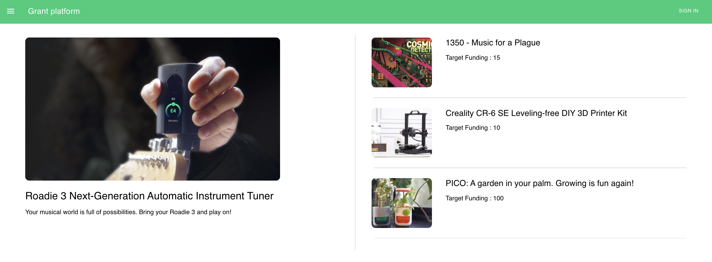

### grant view

Detail view for grant:

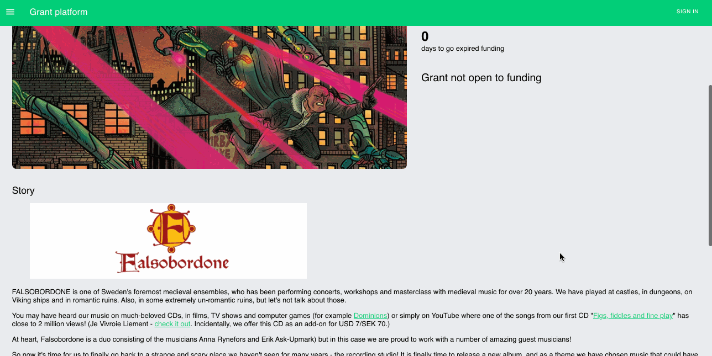

### my-grants

Index view for all user grants. User would be one of a Donor, Grantee, or Manager. Grants arranged in columns based on role.

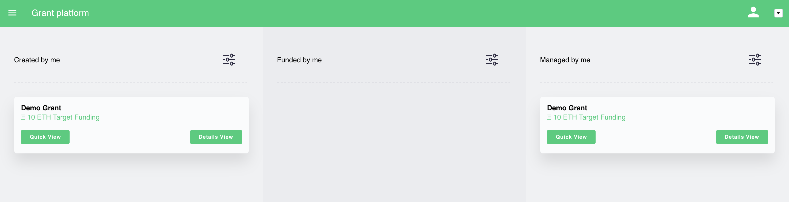

### create-new-grant

Configure and launch a new grant contract.

Grant description is stored in back end db.

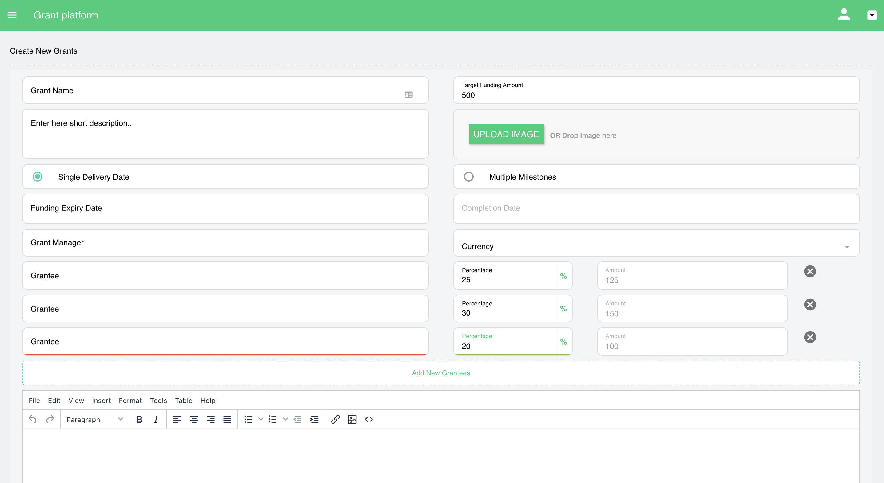

Grant funds may be split between grantees by indicating precise amounts or by diving into percentages

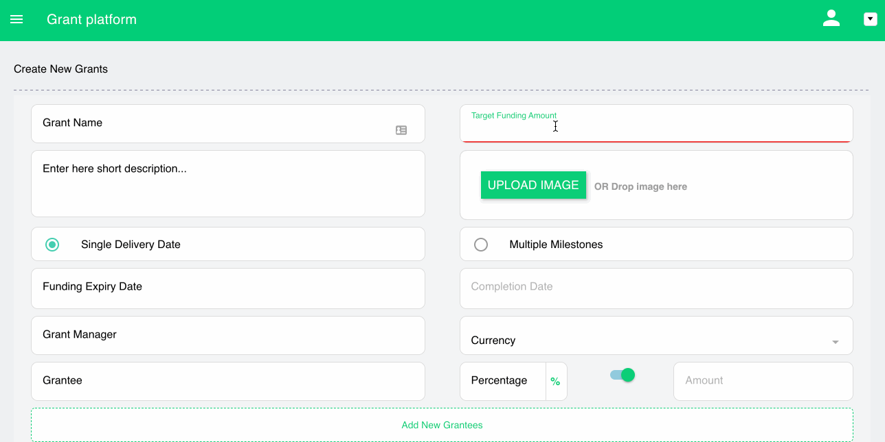

### grant-details

Shows current state of grant. Based on role, more or less interaction options exist (e.g. cancel grant, approveRefund, fund, etc.).

#### Grantee View (grant details)

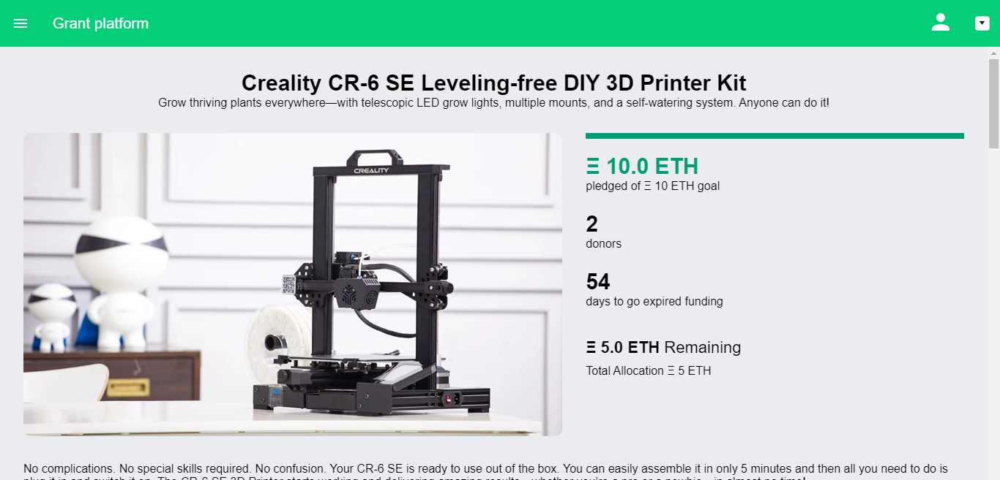

#### Donor View (grant details)

Pre-funding
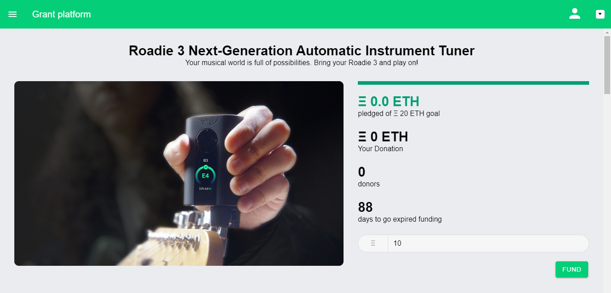

Post-funding
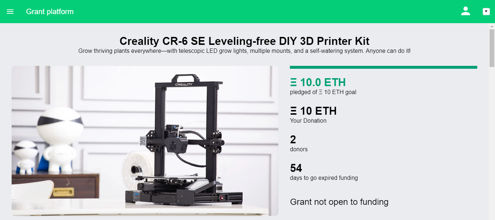

#### Grant Manager View (grant details)

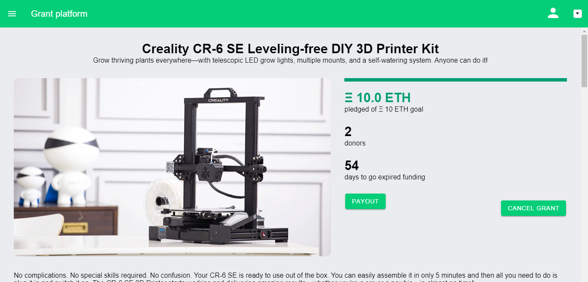

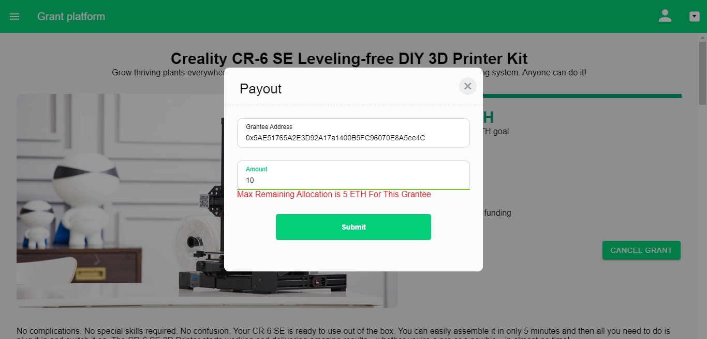

### latest-grants

Unfiltered list of recent grants. (click to view)

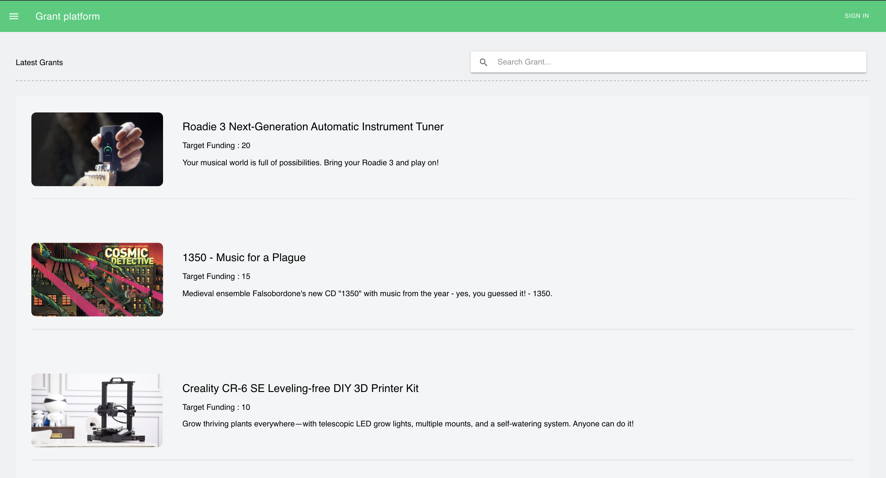

### auth

Sign-in with metamask.

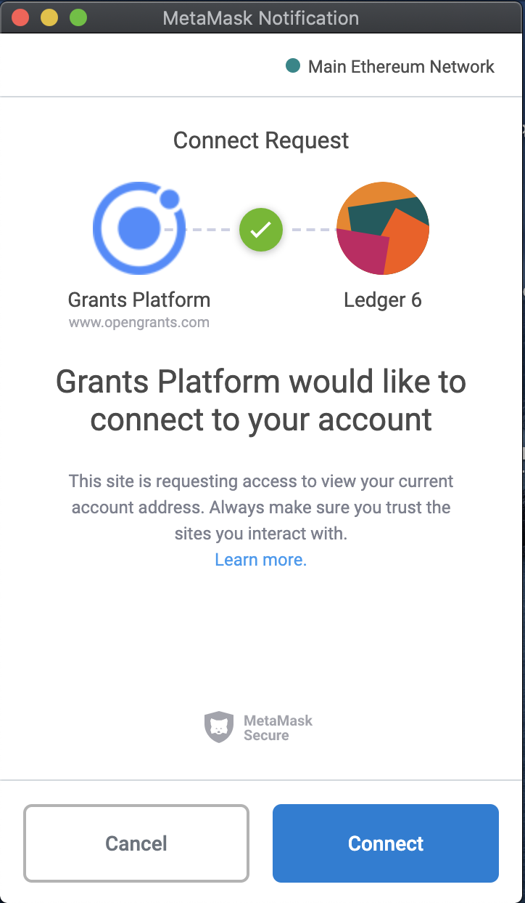
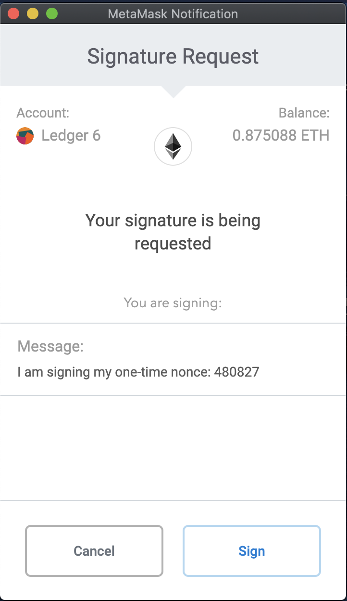

## app/services

- Smart contract calls are managed by `src/app/services/ethcontract.service.ts` and currently assume a Metamask web3 provider is available on the page.
- Auth services are currently handled by `src/app/services/auth.service.ts`.
- The Graph queries are managed by `src/app/services/subgraph.ts`.


#### Backlog

- [ ] Enforce correct network from web3provider & environment (The Graph queries testnet only until prod launch)
- [ ] DAI support
- [ ] Arbitrary token support
- [ ] ENS integration
- [ ] Revise EIP
- [ ] Put 3box back in to support grant descriptions & user preferences
- [ ] Hide grants (user preference)


# Dev Setup

```{sh}
git clone git@github.com:NoahMarconi/grants-platform-mono.git

cd grants-platform-mono

# from project root
npm i
npm run start

```